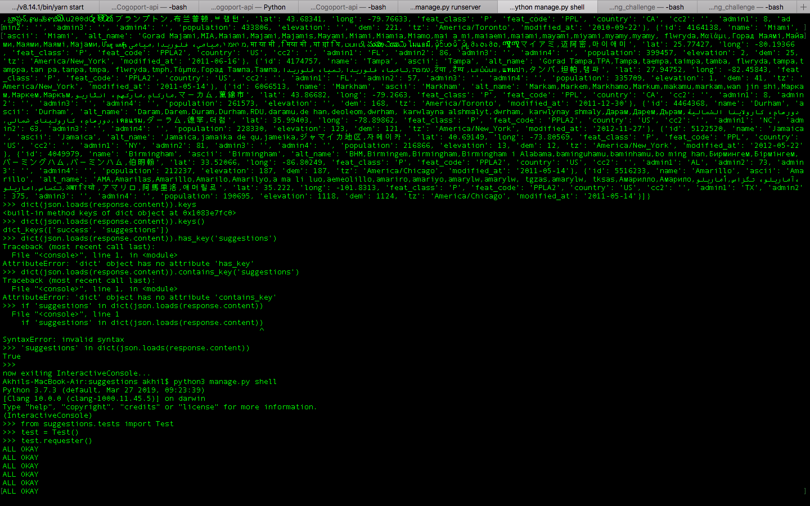

# Tech Stack

This project is made using **python3-django DRF** and **MongoDB** in backend. **ReactJS** in frontend.

#   Libraries Used
  - google-maps-react
  - pymongo
  - axios (for request/response handling)
  - JSONResponse library for response.
  
#   Youtube Demonstration link:
https://www.youtube.com/watch?v=lPPb2nigwSw

#   Test

